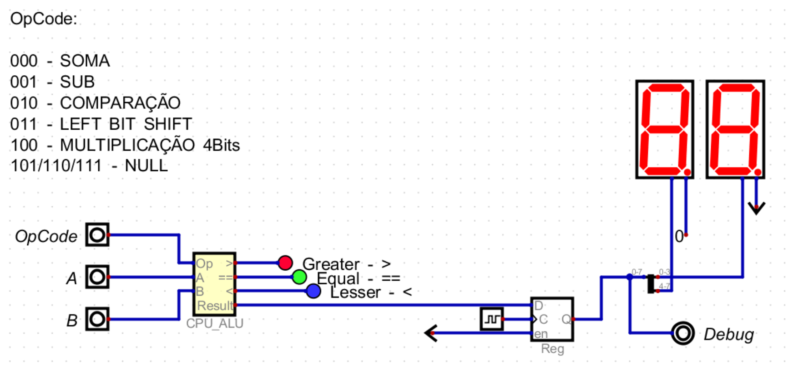

# ALU no Digital Sim - Ponderada 01

_Video de demonstração com explicação de cada circuito -> [Link da Demonstração](https://youtu.be/YG1KipcFK10)_

---------

Desenvolvimento de uma ALU (Arithmetic Logical Unit) simples no simulador de circuitos [Digital](https://github.com/hneemann/Digital)

- Uma ALU (Arithmetic Logical Unit) com **soma, subtração, comparação, left bit shift e multiplicação**.
- Um circuito de controle capaz de selecionar qual operação deve ser feita a partir de _opcodes_.
- Duas entradas de dados de 8 bits (A e B) e uma entrada de dados para o opcode, com 3 bits (op).
- A saída deve ser feita utilizando um registrador de 8 bits ligado a dois displays de sete segmentos.

## ALU

A ALU seguinte tem a capacidade de execução das seguintes operações, **soma, subtração, comparação, left bit shift e multiplicação**.

### Soma

O circuito abaixo é um **8 Bits Full Adder** conta com 2 entradas de 8 bits para _A_ e _B_, um _Carry In_ de 1 bit e 8 Full Adders de 1 bit conectados em sequencia.

Circuito do Full Adder de 1 Bit:

### Subtração

Para a subtração o circuito tem 2 entradas de 8 bits, com a entrada B conectada a um inversor. Essas entradas são conectadas a um full adder de 8 bits, com o _Cin_ conectado a um sinal estatico de **1**

### Comparação

Para a comparação, primeiro é necessario criar um comparador de 1 bit

Logo em seguida foi necessario conectar 8 desses comparadores em sequencia para criar o Comparador de 8 bits

### Left Arithmetic Shift

Para implementar essa operação, usei o arithmetic left shift

### Mutiplicador

O multiplicar aplicado foi o _adder multiplier_ que consiste em uma serie de half e full adders em conexão com portas logicas ANDs, no circuito abaixo usei apenas full adders por questão de praticidade.

O multiplicador abaixo possui 2 entradas de 4 Bits e tem como saida um resultado de 8 bits

### Circuito da ALU

Juntando todas as operações, foi montada a ALU. Esse circuito possui 2 entradas de 8 bits e uma entrada para o Codigo de operaçoes de 3 bits

### Display

Por fim, a saida da ALU é mostrada em um display de sete segmentos hexadecimal, escolhido por simplicidade de aplicação

### Demonstração

[Link da Demonstração](https://youtu.be/YG1KipcFK10)